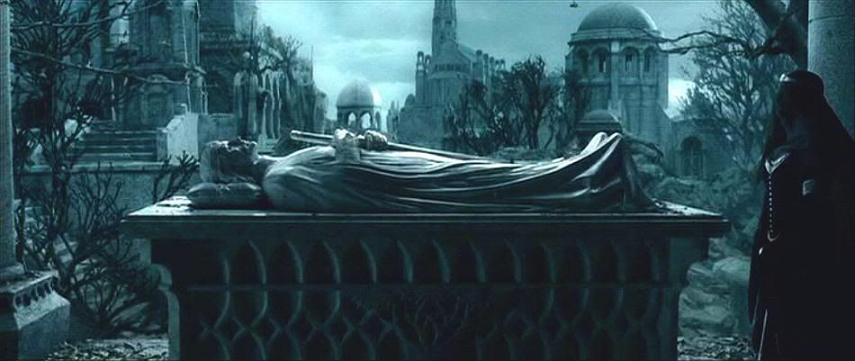

# vasiyetname
Her an ölme ihtimalime karşın vasiyetnamemi public olarak yayınlıyorum. 

1. Öldüğümde mezarımın aragornun mezarı gibi işlemeli olmasını istiyorum. Elimde kılıç tutar pozisyonda yatmalıyım. Örnek aşağıdaki gibidir. Gerekirse vücudum kullanılarak kalıp alınmasına izin veriyorum. Heykeltraşın masrafları kişisel banka hesabımdaki para ile karşılansın.

2. Telefon, tablet, bilgisayar... gibi parola veya parmak izimle açılan kişisel eşyalarımın hard reset atıldıktan sonra bir sandıkta depolanmasını istiyorum.
3. Her ölüm yıl dönümümde sevenlerim tarafından benim sevdiğim yemeklerden oluşan bir sofra kurulmasını istiyorum. Başlıcaları: Çiğköfte, tarhana çorbası, kelle paça, sırın, mantı...
4. ...